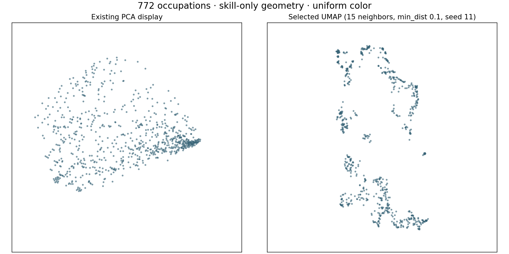

# Offline UMAP versus PCA comparison

This is the original comparison before the later visual spacing adjustment. The interactive map now uses UMAP only and adds bounded spacing between crowded circles. The scores below refer to the original evaluated coordinates, not the adjusted display.

UMAP selected seed 11: tie-aware mean recall 52.7%; displayed PCA 30.3%. Configuration mean across three seeds 52.9%. Passed the predefined improvement gate.

Contract: P-projection-v1; parent-approved AS-PROJECTION rev1. Local comparison only. The protocol and selection policy were written before fitting. All 27 prescribed runs succeeded; no additional tuning was performed. The shipped layout uses the prescribed seed 11, not the highest-scoring seed.

| Displayed layout | Recall at 5 | Recall at 10 | Recall at 20 | Mean S |
|---|---:|---:|---:|---:|
| PCA with existing coincidence offsets | 25.23% | 29.18% | 36.63% | 30.35% |
| Raw PCA (supplemental) | 32.12% | 32.69% | 38.35% | 34.39% |
| Selected UMAP, seed 11 | 51.79% | 52.42% | 53.91% | 52.71% |

All occupations have equal weight. The primary score measures source Jaccard neighborhood retention after display normalization and UMAP coordinate rounding to eight decimal places. It excludes self. Boundary-distance ties receive interchangeable credit only up to the remaining quota, so missing a strictly closer source neighbor still loses credit. Euclidean display-distance ties resolve by canonical occupation code. Source equality tolerance is 1e-12.

The practical gate requires the three-seed mean S to exceed displayed PCA by at least 0.02, no lower three-seed mean recall at any k, and every seed S strictly above PCA. Only configurations with all three successful seeds can qualify. Highest qualifying mean S wins; exact ties use higher worst-seed S, then fixed grid order.

| Neighbors | Minimum distance | Mean S | Population SD | Worst seed S | Qualifies |
|---:|---:|---:|---:|---:|---|
| 15 | 0.1 | 52.91% | 0.17% | 52.71% | True |
| 15 | 0.3 | 51.68% | 0.42% | 51.19% | True |
| 15 | 0.5 | 49.32% | 0.19% | 49.06% | True |
| 30 | 0.1 | 49.50% | 0.59% | 48.68% | True |
| 30 | 0.3 | 48.04% | 0.06% | 47.95% | True |
| 30 | 0.5 | 46.42% | 0.46% | 45.78% | True |
| 60 | 0.1 | 45.83% | 0.20% | 45.60% | True |
| 60 | 0.3 | 44.84% | 0.28% | 44.47% | True |
| 60 | 0.5 | 43.73% | 0.62% | 42.90% | True |

The input contains 772 occupations and 35 binary skill indicators, 597 distinct profiles, 517 occupations whose profile occurs once, and 255 occupations sharing a profile. There are 12 empty skill sets and no missing binary entries. Missing source ratings are handled by the existing aggregation before binarization, not invented by this experiment. All 772 source occupations are represented.

Two empty sets have Jaccard distance zero for the embedding metric. The neighbor panel separately defines empty-set similarity as zero and requires a shared skill; its behavior is unchanged. Identical binary profiles may separate algorithmically in UMAP; no forced collision offsets or AI-based separation were added.

| Source population | PCA recall 5 / 10 / 20 | UMAP seed 11 recall 5 / 10 / 20 |
|---|---|---|
| singletonProfiles | 17.10% / 23.38% / 32.07% | 44.22% / 46.38% / 47.92% |
| repeatedProfiles | 41.73% / 40.94% / 45.86% | 67.14% / 64.67% / 66.06% |

Neighbor stability counts shared exact binary-profile identities as a multiset: sum of minimum counts divided by k, averaged over all occupations. This avoids penalizing exchanges between occupations with identical profiles. All 27 within-configuration seed pairs and all 12 adjacent-setting pairs at seed 11 are saved in report.json.

| Stability comparisons | Mean at 5 | Mean at 10 | Mean at 20 |
|---|---:|---:|---:|
| seedPairs | 61.62% | 69.86% | 76.87% |
| adjacentSettings | 58.54% | 66.09% | 72.25% |

Selected-configuration seed-pair stability (mean): k=5: 70.39%; k=10: 76.40%; k=20: 82.03%.

Canonical top-k source graphs are symmetrized for the component diagnostic: k=5: 2 components; k=10: 2 components; k=20: 1 components. Ties are resolved by occupation code for this diagnostic, so it is not a tie-invariant connectivity claim. It does not affect selection.

This is an in-sample descriptive comparison of two layouts against the same binary skill representation, not a holdout estimate or external occupational ground truth. Grid selection can favor this dataset. Seed standard deviation is descriptive, not a confidence interval. UMAP axes, cluster gaps, densities, and global distances do not establish substantive occupational or AI-risk differences. Exposure/outlook fields are absent from the canonical model input. Colors in the optional comparison plot are uniform and were created after selection.

UMAP supports precomputed distances, and its neighborhood and minimum-distance parameters control the balance and packing of the display. See the [official parameter documentation](https://umap-learn.readthedocs.io/en/latest/parameters.html). Fixed random state and single-thread execution support repeatability; see [official reproducibility documentation](https://umap-learn.readthedocs.io/en/latest/reproducibility.html). The actual experiment pins umap-learn 0.5.4 and the versions in requirements.txt; the linked documentation may describe a newer release. The selected seed reproduced all rounded coordinates exactly on the recorded environment. Cross-version or cross-platform bitwise equality is not established.

Reproduce from the repository root (Node dependencies and the pinned Python environment must already be installed):

```text
npx tsx scripts/projections/export-input.ts
python -m unittest discover -s scripts/projections -p 'tests*.py' -v
python scripts/projections/evaluate.py
python scripts/projections/evaluate.py --recompute
python scripts/projections/write-report.py
```

The exporter calls the application’s existing buildOccupationMap aggregation and PCA implementation. Run evaluate.py once to execute the full fixed grid plus the single selected-seed confirmation; --recompute only verifies saved coordinates, selection, metrics, report, artifact bytes and checksum without fitting. Every run stores coordinates, parameters, versions, warnings and timings. input.json contains the canonical input and both PCA baselines; protocol.json is the fixed policy; report.json stores complete metrics and stability; reproduction.json stores the confirmation coordinates. The public artifact and its pinned byte hash are generated from the selected rounded coordinates.

Profile SHA-256: `c88aacb2509cfe449f906e24446ede8b860c1ce0d08a6a715b3cb260835c5001`. Artifact SHA-256: `4a656982d34f4ef6a278f4d72052629837aa7c043330fc5a061d5dcec8a6fc60`.


